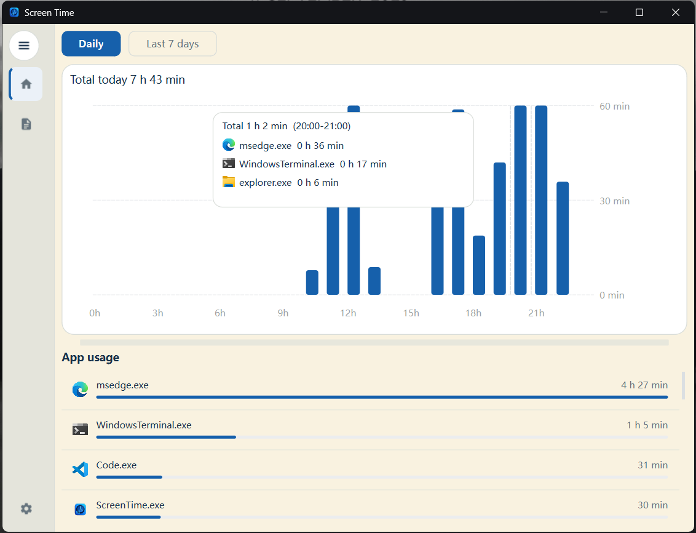
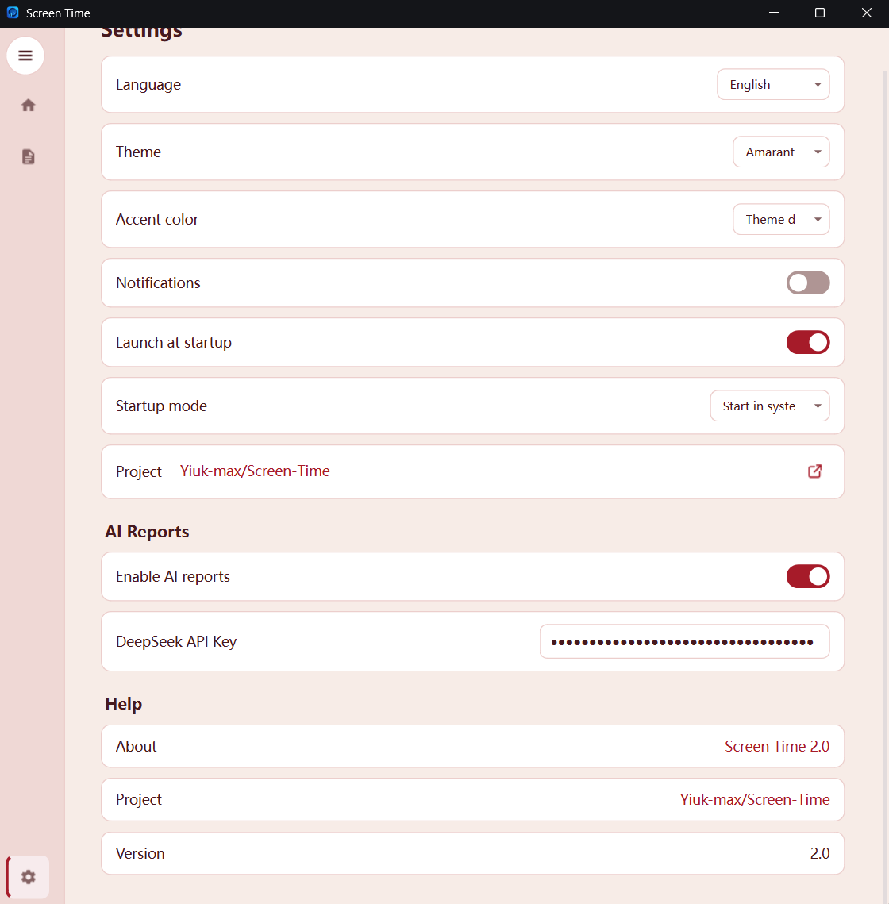
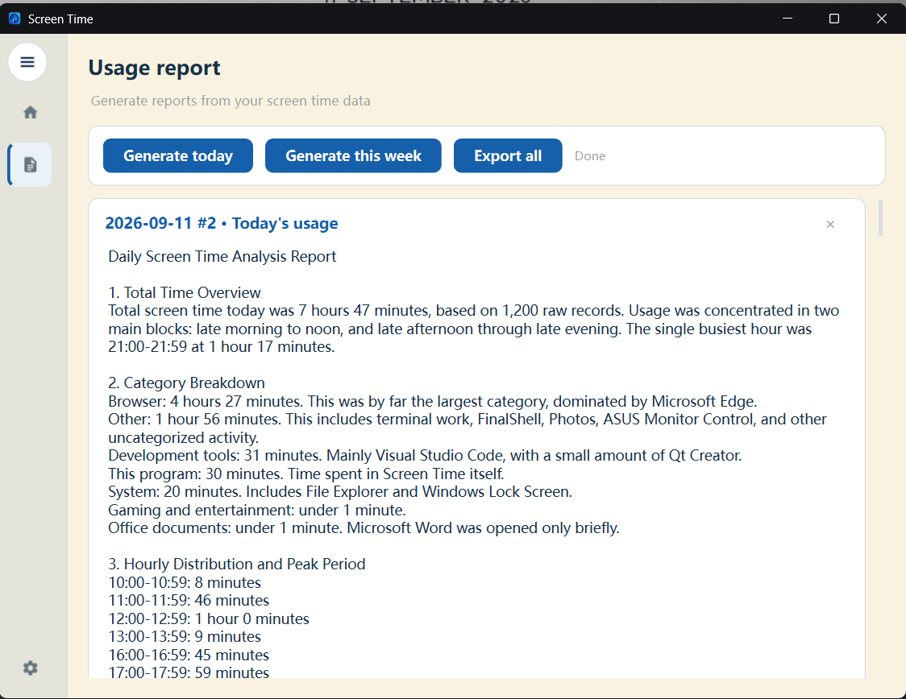

# Screen Time

一个基于 Qt 开发的 Windows 程序使用时间统计工具，帮助我们更好的使用电脑

可统计当天和过去七天内，电脑使用总时间及各应用程序的使用时间。
#项目已上架至微软商店
现在你可以直接搜索"The screen time"安装
或者通过链接"https://apps.microsoft.com/detail/9N99N8P4VR3H?hl=zh-hans-cn&gl=CN&ocid=pdpshare"
## 效果演示

## 功能

1.【功能】支持查看当天和近七天两种使用状况

2.【功能】使用情况会以柱状图方式显示

3.【功能】鼠标悬停至柱状图会显示对映时段使用总时间及使用时间最长的三个程序

4.【功能】柱状图下方的"应用统计"会详细统计各程序统计情况

5.【功能】你可以在主界面拖动中间的横条来调整"条形统计图"和"应用统计的大小"

6.【设置】支持开机自启动，可以选择后台启动到托盘 或者 启动后显示程序

7.【其它】你可以从设置里面跳转到本项目的github地址，以便下载最新版本

## 运行要求

|系统|Windows 10 及以上|
|----|---------------|
|CPU|能转就行|
|内存|20MB及以上|
|存储|100MB及以上|

>第一次写readme，写的不好请见谅
