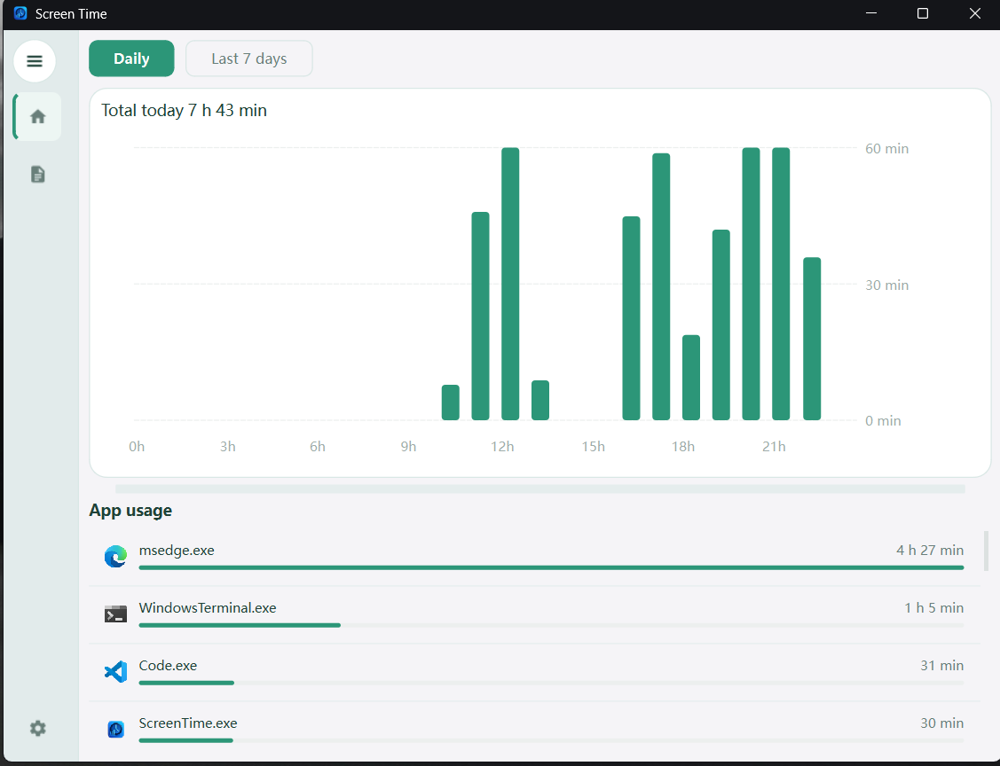

# Screen Time

一款使用 Qt 6 开发的 Windows 屏幕使用时间统计工具。它会在本地记录前台应用的使用时长，并提供当天、近七天和 AI 分析报告。

[](https://apps.microsoft.com/detail/9N99N8P4VR3H)

## 界面预览

### 使用统计




### 设置与 AI 报告


## 功能

- 统计当天和近七天的电脑使用时间
- 按小时或日期显示柱状图，悬停可查看时段总时长和常用应用
- 汇总应用使用时长，并支持拖动分隔条调整图表与列表区域
- 生成当天或本周的 AI 使用报告，支持导出历史报告
- 支持系统托盘、开机自启动，以及启动到托盘或主窗口
- 内置跟随系统、浅色、深色和六套传统色主题，并可单独选择强调色
- 支持简体中文、繁體中文、English、Deutsch、Français、Nederlands、Українська、हिन्दी、Тоҷикӣ
- 使用 SQLite 本地保存记录，默认位于 `%APPDATA%\ScreenTime\screen_time.db`

> AI 报告需要用户自行填写 DeepSeek API Key；普通使用统计不依赖网络。

## 系统要求

- Windows 10 或 Windows 11
- 约 100 MB 可用磁盘空间

## 从源码构建

依赖：CMake 3.16+、支持 C++17 的编译器，以及带有 Core、GUI、Widgets、SQL、Charts、SVG、Network 模块的 Qt 6。

```bash
cmake -B build -DCMAKE_BUILD_TYPE=Release -DCMAKE_PREFIX_PATH="D:/Qt/6.x.x/mingw_64"
cmake --build build
```

也可以直接使用仓库中的 MinGW 预设；如 Qt 安装路径不同，请先修改 `CMakePresets.json`：

```bash
cmake --preset mingw-release
cmake --build --preset mingw-release
```

## 打包

```bat
REM 构建、部署 Qt 依赖并生成全部发布包
deploy-scripts\pack_release.bat

REM 仅生成 MSIX / Microsoft Store 上传包
deploy-scripts\pack_msix.bat
```

产物位于 `release-package/`：

| 产物 | 用途 |
|---|---|
| `ScreenTime_<版本>.zip` | 免安装版本 |
| `ScreenTime_Setup_<版本>.exe` | Inno Setup 安装包 |
| `msix/ScreenTime_<版本>.msix` | MSIX 包 |
| `msix/ScreenTime_<版本>.msixupload` | Microsoft Store 上传包 |

MSIX 身份、签名和旁加载说明见 [installer/msix/README.md](installer/msix/README.md)。

## 项目结构

```text
core/          应用跟踪、数据库、自启动和 AI 报告
ui/            主窗口、图表、主题和多语言
installer/     Inno Setup 与 MSIX 清单
deploy-scripts/构建及打包脚本
screenshots/   README 界面截图
```
